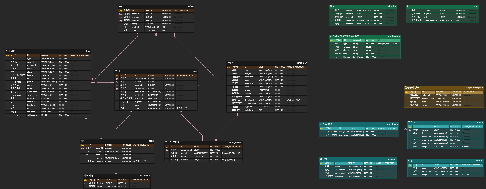

# 꽃다발 커스텀 서비스, 너를 닮은 꽃

> `2022.10.11 ~ 2022.11.20`
> 스토리텔링 마케팅과 커스텀 서비스를 중심으로, 불안정한 화훼산업을 다시 꽃피울 수 있게 하는 서비스

## 1. 서비스 소개 :cherry_blossom: 

**초개인화, 초맞춤화를 원하는 현 소비 트렌드에 맞춘 개인 맞춤형 커스텀 꽃다발 제작 중계 플랫폼**

- 구매자는 개인 취향 및 개인 만족 커스텀 꽃다발 시안을 제작해 플로리스트에게 의뢰
- 플로리스트는 개인이 원하는 꽃, 원하는 디자인에 맞게 꽃다발을 제공

**:bulb: 주요 기능**

| 기능  | 내용                                                         |
| :---- | :----------------------------------------------------------- |
| 기능1 | DnD를 이용한 개인 맞춤형 커스텀 꽃다발 제작 기능             |
| 기능2 | 구매자와 판매자와의 비휘발성 채팅 기능을 제공함으로써 사용자 니즈에 맞는 커스텀 꽃다발 의견 조율 가능 |
| 기능3 | SEO 최적화를 통해 콘텐츠를 검색 결과의 상위에 표시함으로써 사이트 유입을 늘림 |
| 기능4 | KaKao Map을 활용한 지역 꽃가게 조회 기능                     |
| 기능5 | 판매자에게 제공되는 주문관리 기능                            |

 

## 2. 프로젝트 설계

### :hammer_and_wrench: 기술 스택

**Front-end**

|  |  |
| :----------------------------------------------------------------------------------------------------------------------------: | :--------------------------------------------------------------------------------------------------------------------------: |
|                                                             HTML5                                                              |                                                             CSS3                                                             |

|  |  |  |
| :-----------------------------------------------------------------------------------------------------------------------------------------------------------: | :--------------------------------------------------------------------------------------------------------------------------------------------------------: | :-------------------------------------------------------------------------------------------------------------------: |
|                                                                            Next.js                                                                            |                                                                            SWR                                                                             |                                                         Redux                                                         |

|  |  |  |
| :----------------------------------------------------------------------------------------------------------: | :-------------------------------------------------------------------------------------------------------------------------------------------------------------------: | :---------------------------------------------------------------------------------------: |
|                                                  Socket.io                                                   |                                                                                 Scss                                                                                  |                                           AXIOS                                           |

**Back-end**

|  |  |  |  |  |
| :----------------------------------------------------------: | :----------------------------------------------------------: | :----------------------------------------------------------: | :----------------------------------------------------------: | :----------------------------------------------------------: |
|                             Java                             |                         Spring Boot                          |                       Spring Security                        |                       Spring Data JPA                        |                          WebSocket                           |

|  |  |
| :----------------------------------------------------------: | :----------------------------------------------------------: |
|                            MySQL                             |                           MongoDB                            |

**DevOps**

|  |  |  |  |
| :--------------------------------------------------------------------------------------------------------------------: | :------------------------------------------------------------------------------------------------------------------------------: | :-----------------------------------------------------------------------------------------------------------------------------------------------------------: | :------------------------------------------------------------------------------------------------------------------------------: |
|                                                         NGiNX                                                          |                                                               aws                                                                |                                                                            Jenkins                                                                            |                                                              docker                                                              |

 

### :hammer_and_wrench: 개발환경

| Backend                     | Frontend              | CI/CD             | 협업툴     |
| --------------------------- | --------------------- | ----------------- | ---------- |
| Java Open-JDK zulu 8.33.0.1 | next 12.3.1           | AWS EC2           | Mattermost |
| Spring Boot Gradle 2.7.5    | React 18.2            | Ubuntu 20.04 LTS  | Webex      |
| Spring Security             | Redux 4.2.0           | Docker 20.10.21   | Notion     |
| Spring Data JPA             | react-redux ^8.0.4    | Jenkins 2.60.3    | GitLab     |
| Spring AOP                  | swr ^1.3.0            | SonarQube : 8.9.9 | JIRA       |
| Log4J2                      | uuid ^9.0.0           |                   |            |
| Spring Validation           | @stomp/stompjs ^6.1.2 |                   |            |
| JJWT                        |                       |                   |            |
| MySQL 5.7                   |                       |                   |            |
| MongoDB 4.4.17              |                       |                   |            |

**EC2 포트 정리**

| API서버 |                        | Socket서버 |                           |
| ------- | ---------------------- | ---------- | ------------------------- |
| PORT    | 이름                   | PORT       | 이름                      |
| 80      | HTTP, Nginx            | 80         | HTTP, Nginx               |
| 443     | HTTPS                  | 443        | HTTPS                     |
| 3000    | Next.js                | 8080       | Spring Boot Socket Server |
| 3306    | MySQL                  | 9090       | Jenkins                   |
| 8080    | Spring Boot API Server | 20173      | MongoDB                   |
| 9090    | Jenkins                |            |                           |
| 20172   | MongoDB                |            |                           |

### :bar_chart: 아키텍처

  

### [:notebook_with_decorative_cover: ERD](#  https://www.erdcloud.com/d/LdDEsEQNLmSyWSkwQ )

 

---

## 3.  너닮꽃 STUDIO 소개 :sunflower: :rose:

<table>
<tr>
<td align="center" width="150px">
	<strong>github</strong>
</td>
<td align="center" width="150px">
    <strong>이름</strong>
</td>
<td align="center" width="150px">
    <strong>역할</strong>
</td>
<td align="center">
    <strong>수행</strong>
</td>
</tr>
<tr>
<td align="center" width="150px">
<a href="[https://github.com/Youji-Sung](https://github.com/Youji-Sung)" target="_blank">

</td>
<td align="center" width="150px">
👑
성유지
</td>
<td align="center" width="150px">
Front-end
</td>
<td align="start">
- DnD 를 이용한 꽃다발 커스텀 제작 기능  - 메인 페이지  - 회원가입  - GA4 UTM
</td>
</tr>
<tr>
<td align="center" width="150px">
<a href="[https://github.com/pfcskms1997](https://github.com/pfcskms1997)" target="_blank">

</a>
</td>
<td align="center" width="150px">
강민성
</td>
<td align="center" width="150px">
Back-end
</td>
<td align="start">
- 서비스의 주요 REST API 설계 및 구현 - 회원/피드/예약/커스텀 - AOP와 Log4J2를 이용한 서버 로깅 시스템  - DBMS(MySQL, MongoDB) 관리  - SonarQube 정적 분석 및 리팩토링
</td>
</tr>
<tr>
<td align="center" width="150px">
<a href="[https://github.com/elqla](https://github.com/elqla)" target="_blank">

</a>
</td>
<td align="center" width="150px">
박다빈
</td>
<td align="center" width="150px">
Front-end
</td>
<td align="start">
- SSG를 적용한 플로리스트 목록 페이지  - 카카오 맵을 활용한 내주변 꽃가게  - 구매자 마이페이지  - 회원정보수정
</td>
</tr>
<tr>
<td align="center" width="150px">
<a href="[https://github.com/clapans](https://github.com/clapans)" target="_blank">

</a>
</td>
<td align="center" width="150px">
박수근
</td>
<td align="center" width="150px">
Back-end
</td>
<td align="start">
- 채팅 관련 소켓, API 서버 구현  - JWT를 이용한 Security 구현  - DB 더미데이터 제작
</td>
</tr>
<tr>
<td align="center" width="150px">
<a href="[https://github.com/minwoo9629](https://github.com/minwoo9629)" target="_blank">

</a>
</td>
<td align="center" width="150px">
이민우
</td>
<td align="center" width="150px">
Front-end
</td>
<td align="start">
- 초기 스켈레톤 구조 설계 및 작성  - SEO 최적화  - 구매자와 판매자간의 비휘발성 채팅 서비스 구현  - Redux 를 이용한 채팅 상태관리
</td>
</tr>
<tr>
<td align="center" width="150px">
<a href="[https://github.com/sc-choi2022](https://github.com/sc-choi2022)" target="_blank">

</a>
</td>
<td align="center" width="150px">
최수연
</td>
<td align="center" width="150px">
Back-end/Infra
</td>
<td align="start" >
- Docker와 Jenkins를 이용한 CI/CD 구축  - 메인서버와 채팅서버를 분리하여 채팅서버의 트래픽 분산  - 사설 도메인 연결 및 관리  - EC2에 NGINX reverse proxy를 구축하고 SSL인증서 설정으로 HTTPS을 적용  - FrontEnd와 BackEnd의 기술스택에 맞는 웹서버 아키텍쳐를 구축 (Spring boot, Next.js, MySQL, MongoDB)
</td>
</tr>
</table>

 

---

## 4. 프로젝트 소개

|                           커스텀                            |                         커스텀                          |
| :---------------------------------------------------------: | :-----------------------------------------------------: |
|  |  |

### 커스텀페이지

- 로그인 여부와 관계없이 커스텀을 할 수 있다.
- 포장종류선택, 사이즈고르기, 커스텀하기, 완성하기에 대한 자세한 설명이 되어있다.
- 드래그앤 드롭을 통해 꽃다발을 원하는대로 커스텀이 가능하며, 꽃마다 자세한 설명이 첨부되어 있다.
- 그 외 랜덤꽃다발 추천, 상황별 꽃다발 추천, 꽃말별 추천이 있다.
- 사진으로 저장하거나 카카오톡을 통해 공유할 수 있다.

 

|                       플로리스트 목록                        |                        내 주변 꽃가게                        |
| :----------------------------------------------------------: | :----------------------------------------------------------: |
|  |  |

### 플로리스트 목록

- 최근등록순, 별점순, 주문량 순으로 목록을 조회할 수 있다.
- 드롭다운 버튼을 통해 지역별 플로리스트 목록을 조회할 수 있다.
- 페이지별로 조회가 가능하고, 검색을 통해 꽃집을 찾을 수 있다. 

### 내 주변 꽃가게

- 필터링된 지역의 꽃가게가 지도상에 표시된며, 정보를 볼 수 있다.
- 가게의 정보 및 휴무일을 확인하고, 카드를 눌러 가게 피드로 접근할 수 있다.

 

|                         메인 페이지                          |                      판매자 마이페이지                       |
| :----------------------------------------------------------: | :----------------------------------------------------------: |
|  |  |

### 메인 페이지

- 상단 네비게이션 바 에서 꽃다발커스텀, 플로리스트, 내 주변 꽃가게로 이동한다.
- 스크롤을 내리면서 서비스의 소개를 확인한다.
- 홈 화면의 최하단에는 평점 상위에 랭크된 플로리스트의 목록을 표시한다.

### 판매자 마이페이지

- 피드 등록하기 버튼을 클릭하여 피드를 등록한다. 사진은 여러장 선택이 가능하다.
- `예약`: 가게에 요청된 예약의 목록을 표시한다.
- `접수` : 상세 정보 에서 주문접수 를 클릭한 주문 목록을 표시한다. 또한 주문을 상태별로 확인 가능하다.
- `완료`: 구매자가 수령을 완료한 주문 목록을 표시한다.

 

|                        판매자 프로필                         |                             채팅                             |
| :----------------------------------------------------------: | :----------------------------------------------------------: |
|  |  |

### 판매자 프로필

- `피드`: 피드에 대한 상세정보 모달이 열린다. 꽃 이름, 가격, 상세 내용 등과 예약하기 버튼 통해 예약할 수 있다.
- `커스텀 예약`: 버튼을 누르면 나의 커스터마이즈 꽃다발 목록을 선택하여 예약 가능하다.
- `후기`: 해당 꽃집에서 구매한 사람의 후기를 확인할 수 있다.

### 채팅

- `로그인한 사용자`: 모든 페이지의 우측 하단에 채팅을 확인할 수 있다.
- `읽지 않은 채팅`은 빨간점으로 표시되고, 원하는 채팅상대와 대화가 가능하다.
- `비휘발성 채팅`으로 이전 채팅 내용이 보존되며, `이미지 전송`이 가능하다.

 

|                      구매자 마이페이지                       |                        회원 정보 수정                        |
| :----------------------------------------------------------: | :----------------------------------------------------------: |
|  |  |

### 구매자 마이페이지

- `예약 목록` : 현재 예약된 상품의 목록을 조회 및 예약 취소 할 수 있다.
- `주문 내역`: 꽃 구매가 완료되면 후기를 통해 별점과 한줄평을 작성할 수 있다.
- `내 디자인`: 내가 디자인한 꽃들을 볼 수 있고, 원하는 디자인 상세페이지에서 예약, 카카오톡 공유, 사진저장이 가능하다.
  지역 필터 및 검색을 통해 예약할 가게를 탐색하고, 가게의 휴무일을 피해 날짜를 지정한 후 요청사항을 작성해 예약한다.

### 회원 정보 수정

- `내 정보 수정`: 닉네임 중복확인, 휴무일 선택, 주소입력을 할 수 있다.
- `비밀번호 수정`: 비밀번호가 양식에 맞는지 체크한 후 변경할 수 있다.
- `회원탈퇴`

 

|                          로그인                           |                           회원가입                           |
| :-------------------------------------------------------: | :----------------------------------------------------------: |
|  |  |

### 로그인

- 예약 서비스를 이용하기 위해 로그인을 필요로 한다.

### 회원가입

- 본인 명의의 이메일을 입력 후, 인증코드를 받아 본인인증을 한다.
- 사용할 아이디와 비밀번호를 형식에 맞게 입력하여 가입 절차를 완료한다.

 

## 5. 프로젝트 산출물

- [UCC](# https://www.youtube.com/watch?v=co4is8k9rjg)

 
